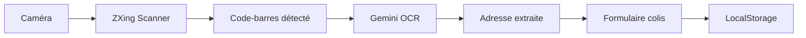
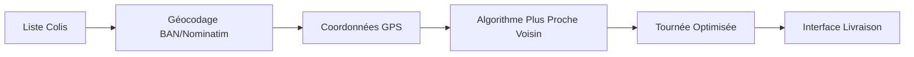
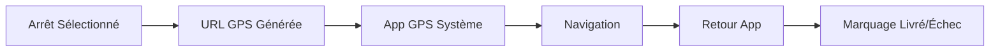

# Architecture Technique - Dawra

## 🏗️ Vue d'ensemble

Dawra est une **Progressive Web App (PWA)** construite avec une architecture moderne orientée composants.

## 📚 Stack Technique

### Frontend
- **React 18+** avec TypeScript
- **Vite** pour le build et dev server
- **Tailwind CSS** pour le styling
- **Lucide React** pour les icônes

### Fonctionnalités Métier
- **@zxing/browser** : Scanner codes-barres
- **@google/generative-ai** : OCR d'adresses via Gemini
- **Leaflet** : Cartes et géolocalisation
- **React Leaflet** : Intégration React

### Stockage et Données
- **LocalStorage** : Données simples et configuration
- **IndexedDB** : Packages et données complexes (via custom hooks)
- **Drizzle ORM** : Base de données relationnelle (LibSQL)

### APIs Externes
- **Nominatim/OpenStreetMap** : Géocodage gratuit
- **BAN (Base Adresse Nationale)** : Adresses françaises
- **Web Speech API** : Reconnaissance vocale

## 🗂️ Structure du Projet

```
src/
├── components/           # Composants React
│   ├── driver/          # Interface chauffeur
│   ├── BarcodeScanner.tsx
│   ├── PackageForm.tsx
│   └── ...
├── hooks/               # Hooks personnalisés
│   ├── usePackages.ts   # Gestion état packages
│   ├── useLocalStorage.ts
│   └── ...
├── services/            # Logique métier
│   ├── geminiOCR.ts     # OCR Gemini
│   ├── geocoding.ts     # Géocodage
│   ├── routeOptimization.ts
│   └── ...
├── types/               # Types TypeScript
├── constants/           # Constantes et config
└── lib/                # Utilitaires et DB
    ├── database/        # Schema et migrations
    └── services/        # Services métier
```

## 🔄 Flux de Données

### 1. Scan de Colis


### 2. Optimisation Tournée


### 3. Navigation


## 🧩 Composants Clés

### DriverDashboard
**Responsabilité :** Point d'entrée principal
- Navigation entre onglets
- État global de l'application
- Coordination des sous-composants

**⚠️ Problème actuel :** 552 lignes, trop volumineux
**🔧 Solution :** Diviser en PackageManager, RouteOptimizer, DeliveryTracker

### usePackages Hook
**Responsabilité :** Gestion état des packages
```typescript
interface Package {
  id: string;
  barcode?: string;
  address: Address;
  location: string;
  status: 'pending' | 'delivered' | 'failed';
  // ...
}

const usePackages = () => {
  const [packages, setPackages] = useState<Package[]>([]);
  // CRUD operations
  return { packages, addPackage, updatePackage, deletePackage };
};
```

### Services Architecture
```typescript
// Couche d'abstraction unifiée (à implémenter)
interface GeoCodingService {
  geocode(address: string): Promise<Coordinates>;
}

class BanGeoCodingService implements GeoCodingService { }
class NominatimGeoCodingService implements GeoCodingService { }
```

## 🔒 Sécurité

### Données Utilisateur
- **Stockage local uniquement** (pas de serveur)
- **Chiffrement sensible** avec Web Crypto API
- **Effacement données** en fin de journée

### APIs Externes
- **Rate limiting** respecté (BAN, Nominatim)
- **Clés API** sécurisées via variables d'environnement
- **Fallbacks** en cas d'indisponibilité

### Code
- **TypeScript strict** pour la sécurité de type
- **Validation entrées** avec Zod (à implémenter)
- **Sanitisation** des données utilisateur

## ⚡ Performance

### Optimisations Actuelles
- **Code splitting** automatique (Vite)
- **Tree shaking** des imports
- **LocalStorage** pour réactivité
- **Service Worker** PWA (basique)

### Optimisations Prévues
- **React.memo** pour composants lourds
- **useMemo/useCallback** pour calculs
- **Web Workers** pour optimisation routes
- **IndexedDB** pour gros volumes

## 🧪 Tests

### Structure Actuelle
```
src/__tests__/
├── addressSearch.test.ts    # Tests API recherche
└── speechRecognition.test.ts # Tests reconnaissance vocale
```

**⚠️ Problème :** Couverture insuffisante (15%)

### Structure Cible
```
src/__tests__/
├── components/         # Tests composants (RTL)
├── hooks/             # Tests hooks personnalisés
├── services/          # Tests logique métier
└── integration/       # Tests bout-en-bout
```

## 🚀 Déploiement PWA

### Service Worker
```javascript
// sw.js (à implémenter complètement)
self.addEventListener('install', (event) => {
  // Cache ressources critiques
});

self.addEventListener('fetch', (event) => {
  // Stratégie cache-first pour offline
});
```

### Manifest PWA
```json
{
  "name": "Dawra - Assistant Livraison",
  "short_name": "Dawra",
  "start_url": "/",
  "display": "standalone",
  "theme_color": "#2563eb"
}
```

## 🔮 Évolutions Techniques

### Court Terme
- **State Management** : Migration vers Zustand
- **Error Boundaries** : Gestion erreurs React globales
- **API Layer** : Abstraction services unifiée

### Moyen Terme
- **Micro-frontends** : Séparation modules métier
- **GraphQL** : API unifiée pour données
- **WebAssembly** : Calculs d'optimisation complexes

### Long Terme
- **Offline-first** : Architecture résiliente
- **Real-time** : WebSocket pour collaboration
- **AI/ML** : Prédictions et suggestions intelligentes

---

*Documentation technique maintenue par l'équipe développement*